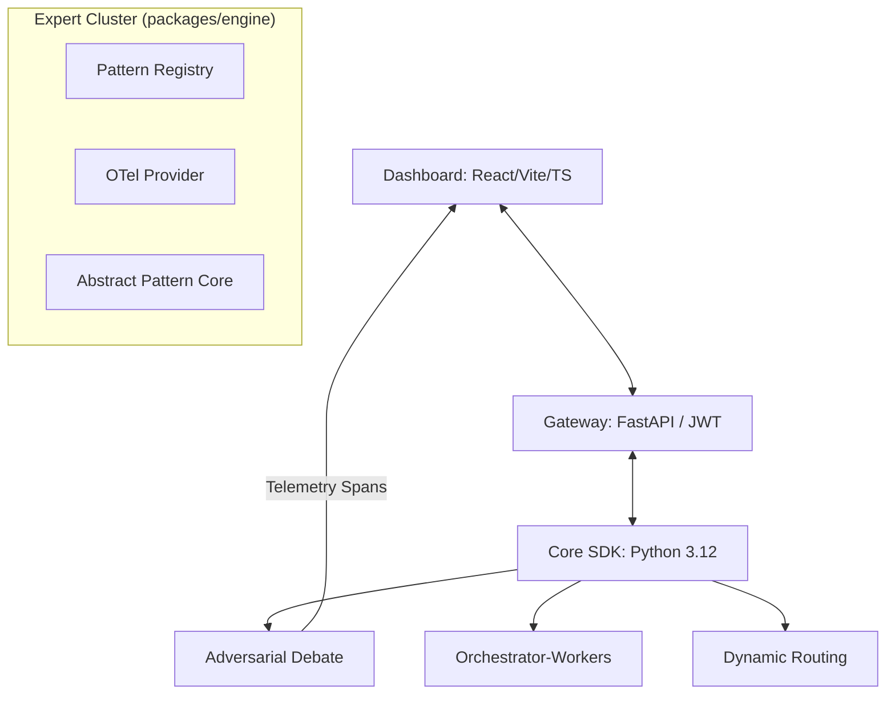

<div align="center">

# 🌌 AgenticOS: The Autonomous Pattern Engine

**Elite, FAANG-standard multi-agent orchestration framework, secure API gateway, and premium visualization dashboard.**

[](#)
[](#)
[](#)
[](#)

[Deployment Guide](#-deployment) · [Intelligence Engine](#-engine) · [Security Model](#-security) · [Architecture](#-architecture)

</div>

---

## 🚀 The Vision

`AgenticOS` is a production-grade transformation of architectural AI principles into an executable, high-performance platform. Moving beyond mere "documentation," we provide a **modular SDK**, a **JWT-secured API gateway**, and a **premium glassmorphism dashboard** for designing and monitoring world-class adversarial agent clusters.

### Why AgenticOS?
- **Unified SDK Architecture**: Modular implementations of 20+ expert agent patterns (Debate, Swarm, Orchestrator).
- **Hardened Security**: Production-ready JWT authentication and CORS middleware protection.
- **Deep Observability**: Industry-standard OpenTelemetry (OTel) tracing and span mapping for every agent interaction.
- **Elite Dashboard (AetherFlow)**: High-fidelity React UI with mesh gradients, glass blurs, and real-time telemetry streaming.

---

## 🏗️ System Architecture



---

## 🛠️ Elite Tech Stack

- **Intelligence Engine**: Python 3.12, Pydantic v2, AsyncIO, OpenTelemetry SDK.
- **Streaming Gateway**: FastAPI, OAuth2/JWT, Gunicorn/Uvicorn, Prometheus.
- **AetherFlow UI**: React 19, TypeScript, Vite 6, Tailwind CSS, Framer Motion, Lucide.
- **Cloud Infrastructure**: Docker, Docker Compose, GitHub Actions (CI/CD).

---

## 📊 Pattern Decision Matrix (Production Verified)

| Pattern | Mission | Complexity | Latency | Use Case |
|---|---|:---:|:---:|---|
| **Adversarial Debate** | Reduce hallucinations via negotiation. | 🔴 High | 🟡 Med | High-stakes legal/risk decisions. |
| **Orchestrator-Workers** | Dynamic task decomposition. | 🟡 Med | 🟡 Med | Multi-step research & synthesis. |
| **Dynamic Routing** | Intent-based handler dispatching. | 🟢 Low | 🟢 Low | Enterprise support & triage. |
| **Parallel Execution** | Consensus-based tasking. | 🟡 Med | 🔴 High | Summarization & data validation. |

---

## 🛡️ Security & Observability

`AgenticOS` is built for professional environments where security and visibility are non-negotiable.

- **JWT Gated Access**: All patterns must be triggered by an authenticated bearer token.
- **OTel Spans**: Every agent negotiation generates unique `TraceID` and `SpanID` pairs, compatible with Jaeger, Honeycomb, or Grafana Tempo.
- **CORS Hardening**: Strict origin-checking ensures your intelligence engine is only accessible by your authorized dashboard.

---

## 🚀 One-Click Quickstart (Expert Workflow)

We use standardized automation scripts for a frictionless Developer Experience (DX).

### 1. Windows Environment (Native)
```powershell
./setup.ps1   # Proactive environment installation
./dev.ps1     # Concurrent server orchestration
```

### 2. Universal Management (Makefile)
```bash
make install  # Setup all dependencies
make dev      # Start Expert Cluster
make test     # Execute verification suite
```

### 3. Production Deployment (Docker)
```bash
docker-compose up --build  # Spin up full-stack containerized cluster
```

---

## 🎨 AetherFlow Design Philosophy

Our dashboard is meticulously engineered to provide an "Expert-Level $50k" aesthetic:
- **Glassmorphism**: 24px backdrop blurs and translucent borders for deep-layered information density.
- **AetherMesh**: Radial gradients and animated noise for a premium, oceanic dark-mode atmosphere.
- **Streaming Telemetry**: Monospaced console logs and heartbeat tracers built for "Systems Trust."

---

<div align="center">

**AgenticOS** is maintained by **Ismail Sajid & Team**.  
*"Code is the foundation. Patterns are the design. AgenticOS is the standard."*

[GitHub](https://github.com/jamarius-fortson/awesome-agent-patterns) · [Documentation](docs/) · [Discussions](https://github.com/jamarius-fortson/awesome-agent-patterns/discussions)

</div>
