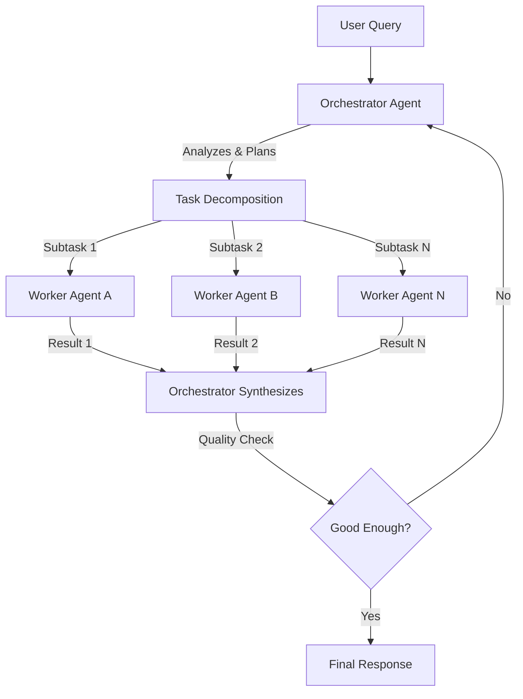

# Orchestrator-Workers

> A central agent dynamically decomposes tasks into subtasks and delegates them to specialized worker agents. Unlike parallelization, the subtasks are NOT predefined — the orchestrator decides what to do based on the input.

## The Problem

You have complex, open-ended tasks where you can't predict in advance what steps are needed. The work requires different types of expertise, and the decomposition strategy depends on the specific input. A single agent either runs out of context or makes poor decisions trying to handle everything.

## Architecture



```
┌────────────────────────────────────────────────────────┐
│                    ORCHESTRATOR                         │
│  1. Analyze input                                      │
│  2. Decompose into subtasks (dynamic, not predefined)  │
│  3. Assign workers                                     │
│  4. Collect results                                    │
│  5. Synthesize final output                            │
│  6. Optionally re-plan if results are insufficient     │
└───────┬──────────────┬──────────────┬──────────────────┘
        │              │              │
   ┌────▼────┐   ┌────▼────┐   ┌────▼────┐
   │Worker A │   │Worker B │   │Worker C │
   │Research │   │Analysis │   │Writing  │
   │+ Tools  │   │+ Tools  │   │+ Tools  │
   └─────────┘   └─────────┘   └─────────┘
```

## When to Use

- **Tasks where decomposition depends on input.** You can't write a fixed pipeline because every input needs different subtasks. Example: "Research the competitive landscape of electric trucks" requires different research threads than "Analyze the Q3 earnings call."
- **Multi-file code changes.** A coding agent that needs to modify multiple files based on a feature request — the orchestrator decides which files need changes and what kind of changes.
- **Research tasks.** Gathering and synthesizing information from multiple sources. This is exactly how Anthropic built their [multi-agent research system](https://www.anthropic.com/engineering/multi-agent-research-system).
- **Complex document generation.** Reports that require data from multiple sources, analysis, and writing — the orchestrator plans the document structure, then delegates sections.

## When NOT to Use

- **Fixed, predictable workflows.** If you always need the same 3 steps in the same order, use [Prompt Chaining](01-prompt-chaining.md) or [Pipeline](09-pipeline.md). The orchestrator's planning step adds unnecessary latency and tokens.
- **Simple classification + action.** If the task is "classify this email and route it," use [Routing](02-routing.md). No orchestrator needed.
- **Tasks where a single agent suffices.** If one LLM call with good tools can solve the problem, don't add an orchestrator. The overhead isn't worth it for simple tasks.
- **Extremely latency-sensitive tasks.** The orchestrator adds a planning step before any work begins. If you need sub-second responses, this pattern is too slow.

## Key Design Decisions

### 1. Worker Specialization
Workers can be **identical** (same prompt, different subtask input) or **specialized** (different prompts, tools, and even models per worker type).

- **Identical workers** are simpler and scale better. Use when all subtasks are the same type (e.g., "research this specific topic").
- **Specialized workers** produce better results when subtasks require genuinely different skills (e.g., one for data analysis, one for writing, one for code review).

### 2. Parallel vs. Sequential Workers
Workers can run **in parallel** (all at once) or **sequentially** (one after another, where later workers use earlier results).

- **Parallel**: Faster. Use when subtasks are independent. This is Anthropic's approach in their research system.
- **Sequential**: Slower but handles dependencies. Use when Worker B needs Worker A's output.
- **Hybrid**: Start with parallel independent tasks, then run sequential dependent tasks.

### 3. Re-planning
The orchestrator can be **single-pass** (plan once, execute, synthesize) or **iterative** (plan, execute, evaluate, re-plan if needed).

Iterative re-planning is more robust but costs 2-5x more tokens. Use it for high-stakes tasks where correctness matters more than cost.

## Implementation

### LangGraph

```python
"""Orchestrator-Workers pattern in LangGraph."""
from typing import Annotated, TypedDict
from langgraph.graph import StateGraph, END
from langchain_openai import ChatOpenAI
from langchain_core.messages import HumanMessage, SystemMessage
import json
import operator

# --- State Definition ---

class OrchestratorState(TypedDict):
    query: str
    plan: list[dict]  # [{task: str, worker_type: str}]
    results: Annotated[list[dict], operator.add]  # Accumulated results
    final_output: str
    iteration: int

# --- Orchestrator Node ---

def orchestrator_plan(state: OrchestratorState) -> dict:
    """Analyze the query and decompose into subtasks."""
    llm = ChatOpenAI(model="gpt-4o", temperature=0)

    response = llm.invoke([
        SystemMessage(content="""You are a task planner. Given a query,
decompose it into 2-5 independent subtasks that can be executed in parallel.

Return JSON array: [{"task": "description", "worker_type": "research|analyze|write"}]

Rules:
- Each subtask must be self-contained
- Subtasks should be parallelizable when possible
- Be specific about what each subtask should produce"""),
        HumanMessage(content=f"Query: {state['query']}")
    ])

    plan = json.loads(response.content)
    return {"plan": plan, "iteration": state.get("iteration", 0) + 1}

# --- Worker Node ---

def worker_execute(state: OrchestratorState) -> dict:
    """Execute all subtasks (in production, run these in parallel)."""
    llm = ChatOpenAI(model="gpt-4o-mini", temperature=0.1)  # Cheaper model for workers
    results = []

    for task in state["plan"]:
        response = llm.invoke([
            SystemMessage(content=f"You are a {task['worker_type']} specialist. "
                          "Complete the following task thoroughly and concisely."),
            HumanMessage(content=task["task"])
        ])
        results.append({
            "task": task["task"],
            "result": response.content
        })

    return {"results": results}

# --- Synthesizer Node ---

def synthesize(state: OrchestratorState) -> dict:
    """Combine all worker results into a final output."""
    llm = ChatOpenAI(model="gpt-4o", temperature=0)

    results_text = "\n\n".join(
        f"## {r['task']}\n{r['result']}" for r in state["results"]
    )

    response = llm.invoke([
        SystemMessage(content="""Synthesize the following research results
into a coherent, well-structured response. Maintain all important details
and cite which subtask contributed each finding."""),
        HumanMessage(content=f"Original query: {state['query']}\n\n"
                     f"Results:\n{results_text}")
    ])

    return {"final_output": response.content}

# --- Build Graph ---

def should_continue(state: OrchestratorState) -> str:
    """Check if we need another planning iteration."""
    if state.get("iteration", 0) >= 2:  # Max 2 iterations
        return "synthesize"
    return "synthesize"  # Single pass by default

graph = StateGraph(OrchestratorState)
graph.add_node("plan", orchestrator_plan)
graph.add_node("execute", worker_execute)
graph.add_node("synthesize", synthesize)

graph.set_entry_point("plan")
graph.add_edge("plan", "execute")
graph.add_edge("execute", "synthesize")
graph.add_edge("synthesize", END)

app = graph.compile()

# --- Run ---
result = app.invoke({
    "query": "Analyze the competitive landscape of AI agent frameworks in 2026",
    "plan": [],
    "results": [],
    "final_output": "",
    "iteration": 0,
})
print(result["final_output"])
```

### CrewAI

```python
"""Orchestrator-Workers pattern in CrewAI."""
from crewai import Agent, Task, Crew, Process

# --- Define Specialized Workers ---

researcher = Agent(
    role="Research Specialist",
    goal="Find accurate, up-to-date information on the given topic",
    backstory="You are an expert researcher who finds reliable sources "
              "and extracts key insights.",
    verbose=True,
    allow_delegation=False,
)

analyst = Agent(
    role="Data Analyst",
    goal="Analyze information and identify patterns, trends, and insights",
    backstory="You are a senior analyst who synthesizes complex information "
              "into clear, actionable insights.",
    verbose=True,
    allow_delegation=False,
)

writer = Agent(
    role="Report Writer",
    goal="Create clear, well-structured written outputs",
    backstory="You are a technical writer who produces publication-ready "
              "documents from raw research and analysis.",
    verbose=True,
    allow_delegation=False,
)

# --- The Orchestrator (Manager) ---

manager = Agent(
    role="Project Manager",
    goal="Coordinate the team to produce the best possible output",
    backstory="You are a senior project manager who decomposes complex tasks, "
              "assigns work to the right specialists, and ensures quality.",
    verbose=True,
    allow_delegation=True,  # Can delegate to other agents
)

# --- Define Tasks ---

research_task = Task(
    description="Research the competitive landscape of AI agent frameworks "
                "in 2026. Cover: market size, top frameworks, adoption rates, "
                "and key differentiators.",
    expected_output="A comprehensive research brief with data and sources.",
    agent=researcher,
)

analysis_task = Task(
    description="Analyze the research findings. Identify the top 3 trends, "
                "compare frameworks on production readiness, and predict "
                "which will dominate in 12 months.",
    expected_output="An analytical report with comparison tables and predictions.",
    agent=analyst,
    context=[research_task],  # Depends on research
)

report_task = Task(
    description="Synthesize the research and analysis into a professional "
                "executive summary. Include key findings, recommendations, "
                "and a comparison matrix.",
    expected_output="A polished executive summary (500-800 words).",
    agent=writer,
    context=[research_task, analysis_task],  # Depends on both
)

# --- Assemble the Crew ---

crew = Crew(
    agents=[researcher, analyst, writer],
    tasks=[research_task, analysis_task, report_task],
    manager_agent=manager,          # Orchestrator
    process=Process.hierarchical,   # Manager delegates
    verbose=True,
)

result = crew.kickoff()
print(result)
```

## Production Considerations

### Token Costs
The orchestrator pattern is token-heavy. Expect:
- **Planning step**: 500-2,000 tokens (orchestrator analyzing + decomposing)
- **Per worker**: 1,000-5,000 tokens (depending on task complexity)
- **Synthesis step**: 1,000-3,000 tokens (combining results)
- **Total**: 4x-15x more tokens than a single agent call

**Mitigation**: Use [Model Tiering](19-model-tiering.md) — a capable model (GPT-4o, Claude Sonnet) for the orchestrator, and a fast/cheap model (GPT-4o-mini, Claude Haiku) for workers.

### Latency
- **Sequential**: Total = plan time + (sum of all worker times) + synthesis time
- **Parallel**: Total = plan time + (max worker time) + synthesis time

Always run workers in parallel when subtasks are independent. Use `asyncio.gather()` in Python.

### Failure Modes
1. **Bad decomposition**: Orchestrator creates overlapping or incomplete subtasks → Workers produce redundant or gapped results. **Fix**: Add examples of good decompositions in the orchestrator's system prompt.
2. **Worker hallucination**: One worker returns fabricated data that the synthesizer includes. **Fix**: Add a verification step, or combine with [Debate](11-debate.md) or [Consensus](12-consensus.md).
3. **Runaway workers**: Worker enters an infinite tool-use loop. **Fix**: Set `max_iterations` per worker. Wrap in [Circuit Breaker](15-circuit-breaker.md).

### Monitoring
Track these metrics:
- Plan quality (do subtasks cover the query?)
- Worker completion rate (how often do workers succeed?)
- Synthesis coherence (does the final output make sense?)
- Total tokens consumed per orchestration run
- End-to-end latency

## Real-World Examples

| System | How They Use It |
|--------|----------------|
| **Anthropic Research** | Lead agent spawns subagents for parallel research. 90.2% improvement over single-agent. |
| **GitHub Copilot Agent Mode** | Orchestrator decomposes coding tasks, delegates to specialized code generation/review agents. |
| **Perplexity Pro** | Query planner decomposes research questions, delegates to search agents in parallel. |
| **Multi-file code editors** | Orchestrator identifies affected files, spawns per-file editing agents. |

## Related Patterns

- **[Supervisor](06-supervisor.md)** — Simpler version where the supervisor routes to pre-defined agents rather than dynamically decomposing tasks.
- **[Hierarchical](07-hierarchical.md)** — Extension with multiple orchestration levels (orchestrator → sub-orchestrators → workers).
- **[Map-Reduce](10-map-reduce.md)** — Similar fan-out structure but with identical workers and a reduce step. Better when all subtasks are the same type.
- **[Parallelization](03-parallelization.md)** — Simpler version where subtasks are predefined at development time, not determined at runtime.

---

*This pattern is the backbone of most production multi-agent systems. When in doubt, start here and simplify if possible.*
