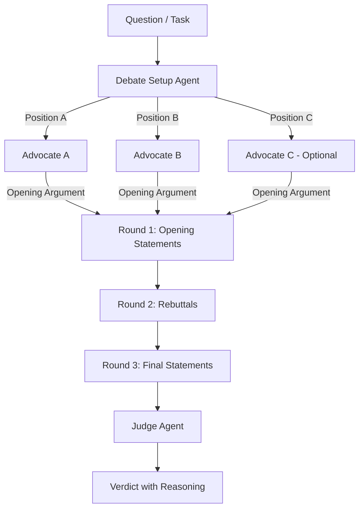

# Debate

> Multiple agents argue opposing positions on a question. A judge agent evaluates the arguments and reaches a verdict. Forces evidence-based reasoning and reduces hallucination by making agents defend their claims.

## The Problem

Single LLM calls are prone to confident hallucination — the model generates plausible-sounding but incorrect information and presents it as fact. When there's no adversarial pressure, the model has no incentive to distinguish between "I'm sure about this" and "I'm making this up."

The Debate pattern introduces **adversarial diversity**: agents with different positions must provide evidence for their claims and challenge each other's reasoning. A judge agent then evaluates which arguments are best supported.

## Architecture



```
Round 1: Opening Statements
┌──────────────┐  ┌──────────────┐  ┌──────────────┐
│  Advocate A   │  │  Advocate B   │  │  Advocate C   │
│  "Position X  │  │  "Position Y  │  │  "Position Z  │
│   because..." │  │   because..." │  │   because..." │
└──────┬───────┘  └──────┬───────┘  └──────┬───────┘
       │                 │                 │
       ▼                 ▼                 ▼
Round 2: Rebuttals (each agent sees others' arguments)
       │                 │                 │
       ▼                 ▼                 ▼
Round 3: Final Statements
       │                 │                 │
       └────────────────►┼◄────────────────┘
                         ▼
                 ┌──────────────┐
                 │    Judge     │
                 │  Evaluates   │
                 │  evidence    │
                 │  quality     │
                 └──────┬───────┘
                        ▼
                 ┌──────────────┐
                 │   Verdict    │
                 │ + Confidence │
                 │ + Reasoning  │
                 └──────────────┘
```

## When to Use

- **Fact-checking and verification.** You need to verify a claim and want to surface counter-evidence before accepting it.
- **High-stakes decisions.** Medical diagnosis support, legal analysis, financial risk assessment — anywhere a confident wrong answer is worse than a slower right answer.
- **Ambiguous questions.** Questions where reasonable people disagree. The debate surfaces the strongest arguments for each position rather than defaulting to the model's trained bias.
- **Reducing hallucination.** When you've observed your agents confidently stating incorrect information, introducing adversarial pressure forces them to back claims with evidence.

## When NOT to Use

- **Clear factual lookups.** "What is the capital of France?" doesn't need a debate. Use a single agent with tools.
- **Creative generation.** Writing, brainstorming, and ideation are harmed by adversarial framing. Use [Evaluator-Optimizer](05-evaluator-optimizer.md) for quality improvement.
- **Speed-sensitive tasks.** Debates require 3-5 LLM calls minimum. If latency matters more than accuracy, use a single agent with [Guardrail Sandwich](17-guardrail-sandwich.md).
- **When all agents use the same model and temperature.** Debate only works with genuine diversity. Same model + same temp = same bias = agents agree or generate artificial disagreement.

## Key Design Decisions

### 1. Diversity Strategy
The debate's value comes from genuine disagreement. Create diversity through:
- **Different models**: Advocate A uses Claude, Advocate B uses GPT-4, Judge uses a third
- **Different temperatures**: Low temp for evidence-focused advocate, high temp for creative challenger
- **Different system prompts**: One advocate is optimistic, another is skeptical
- **Assigned positions**: Force agents to argue specific sides regardless of their "opinion"

### 2. Number of Rounds
- **1 round** (opening statements only): Fastest. Good enough for simple fact-checking.
- **2 rounds** (opening + rebuttal): Best tradeoff. Advocates can challenge each other's evidence.
- **3 rounds** (opening + rebuttal + closing): Most thorough. Use for high-stakes decisions.

More rounds have diminishing returns and escalating token costs.

### 3. Judge Independence
The judge should NOT see the question before seeing the arguments. This prevents the judge from forming an opinion before evaluating evidence. Feed the judge arguments only, then reveal the original question for final verdict.

## Implementation

### LangGraph

```python
"""Debate pattern in LangGraph."""
from typing import TypedDict
from langgraph.graph import StateGraph, END
from langchain_openai import ChatOpenAI
from langchain_anthropic import ChatAnthropic
from langchain_core.messages import HumanMessage, SystemMessage

class DebateState(TypedDict):
    question: str
    position_a: str
    position_b: str
    argument_a: str
    argument_b: str
    rebuttal_a: str
    rebuttal_b: str
    verdict: str

# --- Use different models for genuine diversity ---

advocate_a_llm = ChatOpenAI(model="gpt-4o", temperature=0.3)
advocate_b_llm = ChatAnthropic(model="claude-sonnet-4-20250514", temperature=0.3)
judge_llm = ChatOpenAI(model="gpt-4o", temperature=0.0)

def setup_debate(state: DebateState) -> dict:
    """Determine the two positions to debate."""
    llm = ChatOpenAI(model="gpt-4o-mini", temperature=0)
    response = llm.invoke([
        SystemMessage(content="Given a question, identify two opposing "
                      "positions that could be argued. Return exactly two "
                      "positions, labeled 'Position A:' and 'Position B:'."),
        HumanMessage(content=state["question"]),
    ])
    lines = response.content.strip().split("\n")
    pos_a = lines[0].replace("Position A:", "").strip()
    pos_b = lines[1].replace("Position B:", "").strip() if len(lines) > 1 else "The opposing view"
    return {"position_a": pos_a, "position_b": pos_b}

def advocate_a_argue(state: DebateState) -> dict:
    """Advocate A presents opening argument."""
    response = advocate_a_llm.invoke([
        SystemMessage(content=f"You are a debate advocate. Argue FOR this "
                      f"position: '{state['position_a']}'. Provide specific "
                      f"evidence, data, and logical reasoning. Be thorough "
                      f"but concise (300 words max)."),
        HumanMessage(content=f"Question: {state['question']}"),
    ])
    return {"argument_a": response.content}

def advocate_b_argue(state: DebateState) -> dict:
    """Advocate B presents opening argument."""
    response = advocate_b_llm.invoke([
        SystemMessage(content=f"You are a debate advocate. Argue FOR this "
                      f"position: '{state['position_b']}'. Provide specific "
                      f"evidence, data, and logical reasoning. Be thorough "
                      f"but concise (300 words max)."),
        HumanMessage(content=f"Question: {state['question']}"),
    ])
    return {"argument_b": response.content}

def advocate_a_rebut(state: DebateState) -> dict:
    """Advocate A rebuts Advocate B's argument."""
    response = advocate_a_llm.invoke([
        SystemMessage(content=f"You are defending: '{state['position_a']}'. "
                      f"Your opponent argued: '{state['argument_b']}'. "
                      f"Identify weaknesses in their argument and reinforce "
                      f"your position. Be specific. (200 words max)"),
        HumanMessage(content=f"Your opening argument was: {state['argument_a']}"),
    ])
    return {"rebuttal_a": response.content}

def advocate_b_rebut(state: DebateState) -> dict:
    """Advocate B rebuts Advocate A's argument."""
    response = advocate_b_llm.invoke([
        SystemMessage(content=f"You are defending: '{state['position_b']}'. "
                      f"Your opponent argued: '{state['argument_a']}'. "
                      f"Identify weaknesses in their argument and reinforce "
                      f"your position. Be specific. (200 words max)"),
        HumanMessage(content=f"Your opening argument was: {state['argument_b']}"),
    ])
    return {"rebuttal_b": response.content}

def judge_verdict(state: DebateState) -> dict:
    """Independent judge evaluates the debate."""
    response = judge_llm.invoke([
        SystemMessage(content="""You are an impartial judge evaluating a debate.
Assess ONLY the quality of evidence and reasoning — not which position you
personally agree with.

For each advocate, rate:
1. Evidence quality (specific data vs. vague claims)
2. Logical coherence (does the argument follow?)
3. Rebuttal effectiveness (did they address the opponent's points?)

Then deliver a verdict with your confidence level (high/medium/low)."""),
        HumanMessage(content=f"""
QUESTION: {state['question']}

ADVOCATE A — Position: {state['position_a']}
Opening: {state['argument_a']}
Rebuttal: {state['rebuttal_a']}

ADVOCATE B — Position: {state['position_b']}
Opening: {state['argument_b']}
Rebuttal: {state['rebuttal_b']}

Deliver your verdict."""),
    ])
    return {"verdict": response.content}

# --- Build Graph ---

graph = StateGraph(DebateState)
graph.add_node("setup", setup_debate)
graph.add_node("argue_a", advocate_a_argue)
graph.add_node("argue_b", advocate_b_argue)
graph.add_node("rebut_a", advocate_a_rebut)
graph.add_node("rebut_b", advocate_b_rebut)
graph.add_node("judge", judge_verdict)

graph.set_entry_point("setup")
graph.add_edge("setup", "argue_a")
graph.add_edge("setup", "argue_b")  # Parallel in production
graph.add_edge("argue_a", "rebut_a")
graph.add_edge("argue_b", "rebut_b")
graph.add_edge("rebut_a", "judge")
graph.add_edge("rebut_b", "judge")
graph.add_edge("judge", END)

app = graph.compile()

# --- Run ---
result = app.invoke({
    "question": "Should companies adopt LangGraph or CrewAI for production "
                "multi-agent systems in 2026?",
    "position_a": "", "position_b": "",
    "argument_a": "", "argument_b": "",
    "rebuttal_a": "", "rebuttal_b": "",
    "verdict": "",
})
print(result["verdict"])
```

## Production Considerations

### Token Costs
A full 2-round debate with 2 advocates costs approximately:
- Setup: ~500 tokens
- 2 opening arguments: ~2,000 tokens
- 2 rebuttals: ~1,500 tokens
- Judge verdict: ~1,500 tokens
- **Total: ~5,500 tokens** (roughly 5x a single-agent call)

### When the Cost is Worth It
Use debate for decisions where the cost of being wrong exceeds $50+ per decision. Examples: medical triage, legal document review, financial risk flags. Don't use debate for low-stakes content generation.

### Failure Modes
1. **Sycophantic agreement**: Both advocates converge on the same position. **Fix**: Assign positions explicitly and instruct agents to argue their assigned side regardless of personal "opinion."
2. **Manufactured disagreement**: Agents fabricate evidence to support weak positions. **Fix**: Require citations or tool-use for evidence gathering.
3. **Judge bias**: Judge consistently favors one style of argument. **Fix**: Use a different model family for the judge than either advocate.

## Real-World Examples

| System | How They Use It |
|--------|----------------|
| **Constitutional AI (Anthropic)** | Uses critique-revision loops similar to debate for safety training |
| **Society of Mind (research)** | Multiple LLM personas debate to reduce bias in reasoning |
| **Legal AI review systems** | Pro/con agents argue both sides of a contract clause before flagging risk |
| **Medical differential diagnosis** | Multiple agents argue for different diagnoses given symptoms |

## Related Patterns

- **[Consensus](12-consensus.md)** — Similar goal (reduce hallucination) but without adversarial structure. Agents work independently, then vote.
- **[Evaluator-Optimizer](05-evaluator-optimizer.md)** — Iterative improvement without opposing positions. Better for quality refinement.
- **[Reflective Loop](13-reflective-loop.md)** — Self-critique by a single agent. Less robust than multi-agent debate but cheaper.

---

*"All truth passes through three stages. First, it is ridiculed. Second, it is violently opposed. Third, it is accepted as self-evident." — The Debate pattern accelerates this process to milliseconds.*
